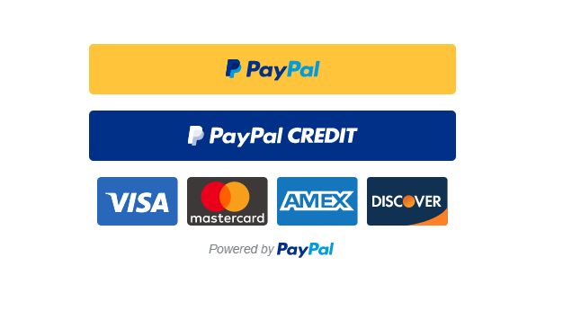

# React-Paypal-Button



a button component to implement PayPal&#39;s Express Checkout in React

## Prerequisites

To use PayPal's Express Checkout you must have a PayPal Business account set up and verified. After this is done, you'll have access to your API credentials to use with this button.

Once you have your account set up you will have 2 different sets of credentials for sandbox mode and prouduction mode. Both will have a clientID, this is what you will use for the productionID prop or the sandboxID prop.

## Installation

```sh
$ npm install react-paypal-button --save
```

## Usage

When using button in Production mode, usage will look like this...

```javascript
import PayPalButton from 'react-paypal-button'

export default class App extends Component {
  render(){
    return (
      <PayPalButton>
        env='production'
        productionID='abcdef123456'
        amount='0.01'
        currency='USD'
        commit={true}
      />
    )
  }
}
```

When testing in Sandbox mode, usage will look like this...

```javascript
import PayPalButton from 'react-paypal-button'

export default class App extends Component {
  render(){
    return (
      <PayPalButton>
        env='sandbox'
        sandboxID='abcdef123456'
        amount='0.01'
        currency='USD'
        commit={true}
      />
    )
  }
}
```
## Development

Install dependencies:

```
$ npm install react-paypal-button
```

Run the example app at [http://localhost:8080](http://localhost:8080):

```
$ npm start
```

Run tests and watch for code changes using [jest](https://github.com/facebook/jest):

```
$ npm test
```

Lint `src` and `test` files:

```
$ npm run lint
```

Generate UMD output in the `lib` folder (runs implicitly on `npm version`):

```
$ npm run build
```

## License

MIT
